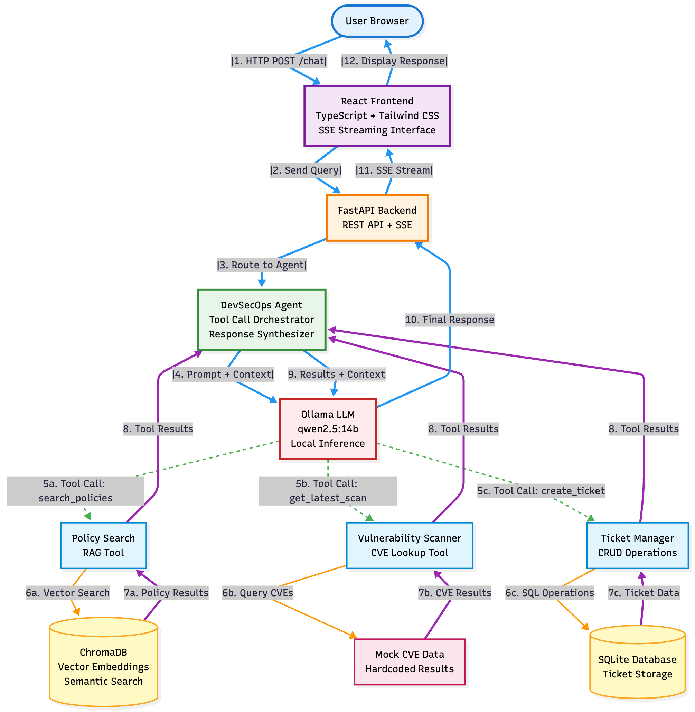

# DevSecOps Knowledge Chat

Multi-tool conversational agent for security operations teams. Built to demonstrate autonomous reasoning, tool orchestration, and transparent decision-making in production security workflows.

## Demo


Watch the full demonstration video to see the agent in action - handling policy queries, vulnerability analysis, and ticket creation with real-time tool transparency.

## What This Does

Implements a conversational interface for three common DevSecOps tasks:

1. **Policy Search** - Semantic search across security documentation using vector embeddings
2. **Vulnerability Analysis** - Query and analyze security scan results with contextual insights  
3. **Ticket Creation** - Generate structured issue reports with automatic priority classification

The agent autonomously selects tools based on user queries, executes them, and synthesizes results into natural language responses.

## Architecture



The system uses a multi-tier architecture:

- **Frontend**: React with TypeScript, real-time SSE streaming for live updates
- **Backend**: FastAPI with async request handling and tool orchestration
- **LLM**: Ollama running qwen2.5:14b locally (no external API calls)
- **Storage**: ChromaDB for vector search, SQLite for structured data

See the Mermaid diagram below for detailed component interactions.

## Technical Stack

| Component | Technology | Purpose |
|-----------|-----------|---------|
| LLM Runtime | Ollama (qwen2.5:14b) | Local inference, zero external dependencies |
| Backend API | FastAPI, Uvicorn | Async endpoints, SSE streaming |
| Vector Store | ChromaDB | Semantic policy search with cosine similarity |
| Database | SQLite | Ticket persistence and retrieval |
| Embeddings | sentence-transformers | Document vectorization for RAG |
| Frontend | React 18, TypeScript | Type-safe UI with real-time updates |
| Styling | Tailwind CSS, shadcn/ui | Consistent design system |
| Build | Vite | Fast development and optimized production builds |

## Quick Start

### Prerequisites

- [Ollama](https://ollama.ai) installed
- Python 3.11 or higher
- Node.js 18 or higher

### Installation

```bash
# Clone and navigate
git clone https://github.com/dsadula10/devsecops-knowledgechat-WB.git
cd devsecops-knowledgechat-WB

# Pull the LLM model (one-time, around 9GB)
ollama pull qwen2.5:14b

# Start everything
chmod +x start-dev.sh
./start-dev.sh
```

The script handles:
- Python virtual environment setup
- Dependency installation for both backend and frontend
- Database initialization with sample data
- Policy document ingestion into vector store
- Service startup (backend on 8000, frontend on 3000)

Access the application at http://localhost:3000

### Docker Deployment

```bash
ollama pull qwen2.5:14b
chmod +x start-docker.sh
./start-docker.sh
```

## How It Works

### Tool Selection

The agent analyzes user queries and determines which tools to invoke. For example:

- "What are our password requirements?" triggers policy search
- "Show me vulnerabilities in project X" triggers scanner lookup  
- "Create a ticket for this issue" triggers ticket creation

### Execution Flow

1. User submits query via web interface
2. Backend receives request, forwards to agent
3. Agent prompts LLM with available tools and user query
4. LLM returns tool selection in JSON format
5. Agent executes selected tool(s)
6. Results are fed back to LLM for synthesis
7. Final response streams to frontend via SSE

### Example Interactions

**Policy Query:**
```
User: What's our MFA policy?
Agent: [Executes: search_policies("MFA policy")]
Response: Multi-factor authentication is required for all administrative 
accounts and recommended for standard users. SMS-based MFA is deprecated 
in favor of authenticator apps or hardware tokens.
```


**Vulnerability Lookup:**
```
User: Latest scan results for web-app-1?
Agent: [Executes: get_latest_scan("web-app-1")]
Response: Scan from Nov 19 identified 5 issues: 2 critical (SQL injection, 
outdated OpenSSL), 2 high (XSS, missing CSRF), 1 medium (weak passwords).
```


**Ticket Creation:**
```
User: File a ticket for the SQL injection
Agent: [Executes: create_ticket(...)]
Response: Created TICKET-A3F2B891 with critical priority. Assigned to 
security team for immediate remediation.
```


## Project Structure

```
.
├── backend/
│   ├── app/
│   │   ├── agent.py          # Tool orchestration logic
│   │   ├── main.py           # FastAPI application
│   │   ├── models.py         # Pydantic schemas
│   │   ├── database.py       # SQLAlchemy configuration
│   │   └── tools/
│   │       ├── rag.py        # ChromaDB policy search
│   │       ├── scanner.py    # Vulnerability lookup
│   │       └── tickets.py    # Ticket CRUD operations
│   ├── scripts/
│   │   ├── init_db.py        # Database seeding
│   │   └── ingest_policies.py # Vector store population
│   └── requirements.txt
├── frontend/
│   ├── src/
│   │   ├── components/
│   │   │   ├── Chat.tsx      # Main interface
│   │   │   ├── Message.tsx   # Message rendering
│   │   │   └── ToolCall.tsx  # Tool execution display
│   │   └── App.tsx
│   └── package.json
├── docker-compose.yml
├── start-dev.sh
└── README.md
```

## Design Decisions

**Why local LLMs?**  
Data privacy and cost control. Security documentation shouldn't leave your infrastructure.

**Why Qwen 2.5 14B?**

It balances strict instruction-following capabilities (crucial for the agent's JSON tool-calling protocol) with performance suitable for local inference, ensuring all data remains on-premises for security.

**Why ChromaDB?**  
Embedded vector database with minimal setup. No separate service to manage.

**Why FastAPI?**  
Native async support, automatic OpenAPI documentation, excellent Python typing integration.

**Why SSE over WebSockets?**  
Simpler implementation for unidirectional streaming. Browser-native EventSource API.

## Development

### Running Tests

```bash
./verify-system.sh
```

Validates:
- System prerequisites (Python, Node, Ollama)
- Service health endpoints
- Tool functionality
- Database connectivity
- Vector search operations

### API Documentation

Interactive API docs available at http://localhost:8000/docs when backend is running.

### Environment Variables

Copy `.env.example` to `.env` and adjust as needed:

```bash
OLLAMA_BASE_URL=http://localhost:11434
OLLAMA_MODEL=qwen2.5:14b
CHROMA_DB_PATH=./data/chroma_db
DATABASE_URL=sqlite:///./data/tickets.db
```

## Known Limitations

- Vulnerability data is mocked for demonstration purposes
- Policy ingestion requires manual script execution
- No authentication layer (suitable for local development only)
- Single-user design (no multi-tenancy support)

## Performance Notes

- Cold start: 3-5 seconds for model loading
- Policy search: Sub-100ms for top-3 results
- LLM inference: 20-30 tokens/sec on modern hardware
- Memory usage: Approximately 4-5GB with loaded model

## Troubleshooting

**Port conflicts:**  
Edit `docker-compose.yml` or `.env` to change default ports (3000, 8000).

**Ollama connection errors:**  
Ensure Ollama is running: `ollama serve`

**ChromaDB issues:**  
Re-initialize the vector store:
```bash
rm -rf backend/data/chroma_db
python backend/scripts/ingest_policies.py
```
